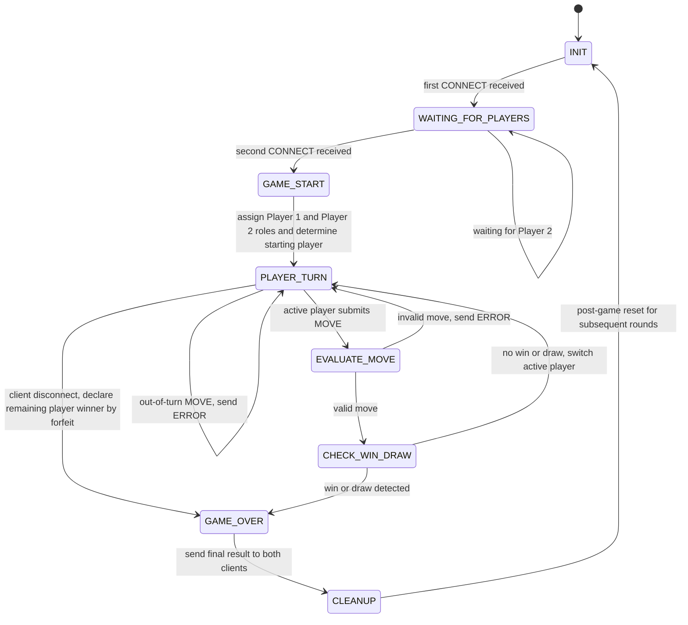

# Game State Machine (FSM) Specification
## Mermaid State Diagram

```mermaid
stateDiagram-v2
  direction TB
  [*] --> INIT
  INIT --> WAITING_FOR_PLAYERS: first CONNECT received
  WAITING_FOR_PLAYERS --> WAITING_FOR_PLAYERS: waiting for Player 2
  WAITING_FOR_PLAYERS --> GAME_START: second CONNECT received
  GAME_START --> PLAYER_TURN: assign Player 1 and Player 2 roles and determine starting player
  PLAYER_TURN --> EVALUATE_MOVE: active player submits MOVE
  PLAYER_TURN --> PLAYER_TURN: out-of-turn MOVE, send ERROR
  PLAYER_TURN --> GAME_OVER: client disconnect, declare remaining player winner by forfeit
  EVALUATE_MOVE --> CHECK_WIN_DRAW: valid move
  EVALUATE_MOVE --> PLAYER_TURN: invalid move, send ERROR
  CHECK_WIN_DRAW --> GAME_OVER: win or draw detected
  CHECK_WIN_DRAW --> PLAYER_TURN: no win or draw, switch active player
  GAME_OVER --> CLEANUP: send final result to both clients
  CLEANUP --> INIT: post-game reset for subsequent rounds
```
